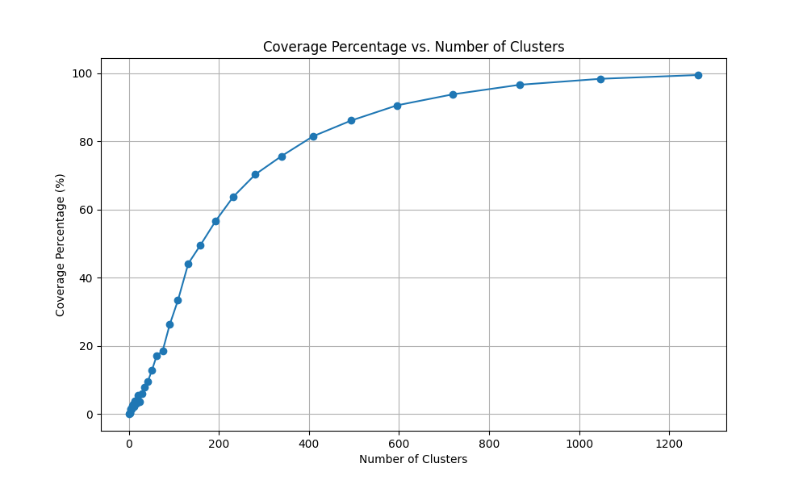

# Preliminary Analysis

This project explores clustering of steepest descent paths based on digital elevation data of Fugloy island. The repository contains Python scripts to calculate the steepest descent paths using a digital surface model and K-means clustering.

## Dataset

The expected input is the `FO_DSM_2017_FOTM_10M.tif` file which is not included in the repository. Auxiliary images representing clusters are stored in the `figures/` directory.

## Example figure

The figure below illustrates coverage percentage as a function of the number of clusters.

## Future work

A short paper will expand on the methodology, including:

- Interpreting cluster patterns.
- Evaluating coverage efficiency.
- Discussing the hydrological implications of path clustering.

